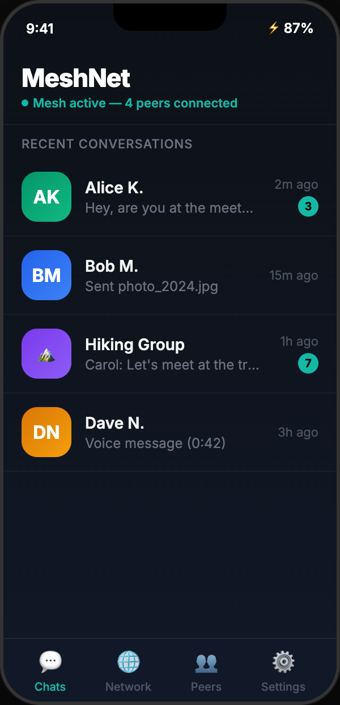
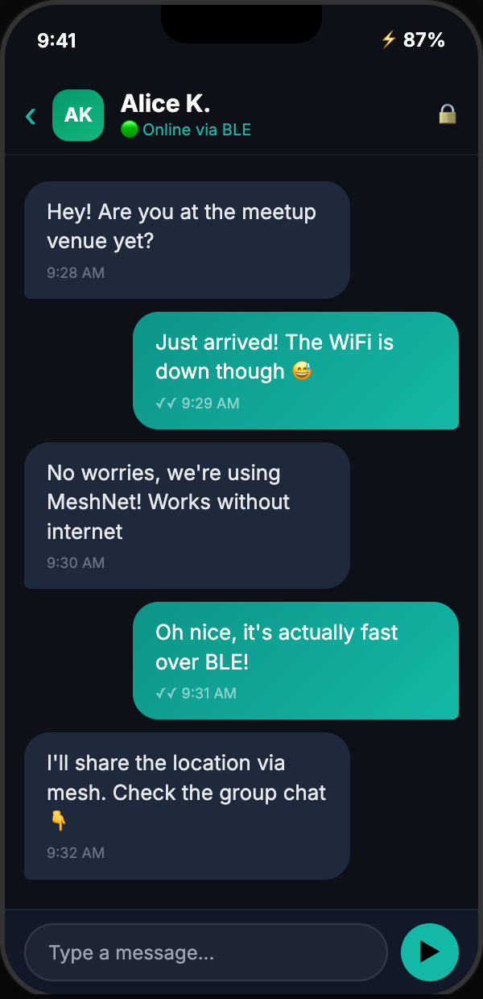
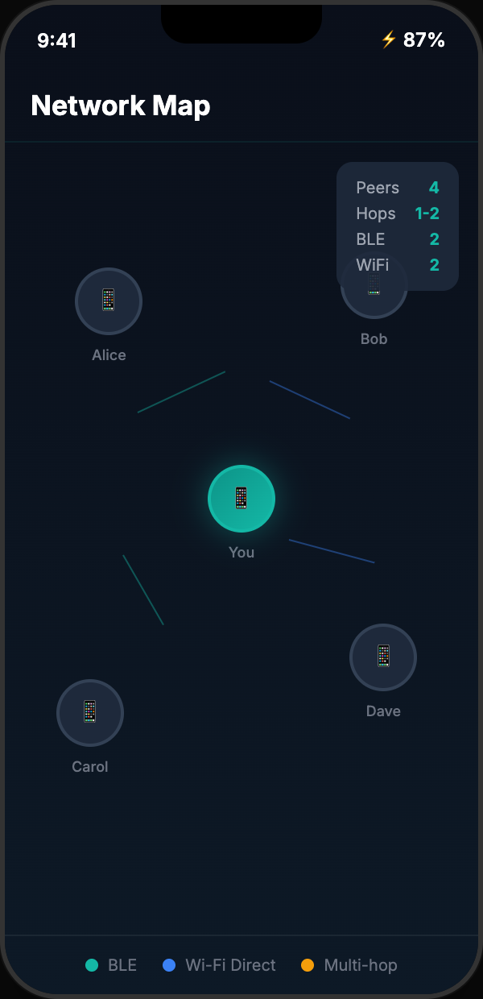
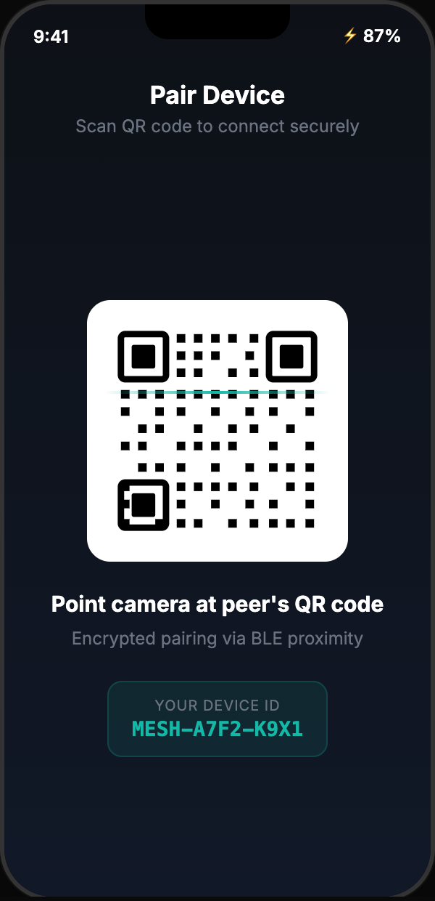
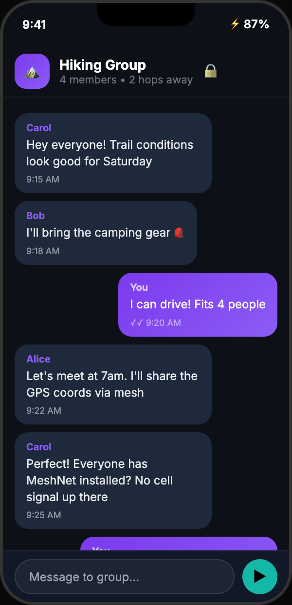

# MeshNet

> **Offline P2P mesh networking for Android -- no internet, no server, no SIM required.**

MeshNet turns Android devices into mesh network nodes. Messages hop through intermediate devices via BLE and Wi-Fi Direct, encrypted end-to-end. When cell towers and WiFi go down, this still works.

**[Download APK](https://github.com/asadbekabdulboqiyev/meshnet_app/releases)** • **[Architecture](ARCHITECTURE.md)** • **AGPL-3.0**

---

## Screenshots

<p align="center">
  
  &nbsp;&nbsp;
  
  &nbsp;&nbsp;
  
  &nbsp;&nbsp;
  
  &nbsp;&nbsp;
  
</p>

## Why

Internet is expensive, unreliable, or censored in many parts of the world. During natural disasters, cellular infrastructure fails first. MeshNet creates a communication layer where **devices are the infrastructure** -- no cell towers, no WiFi routers, no cloud servers needed.

## Features

- **Offline mesh networking** -- BLE + Wi-Fi Direct dual transport
- **Multi-hop relay** -- messages hop through peers (up to 4 hops)
- **E2E encryption** -- ChaCha20-Poly1305 + X25519 key exchange + Double Ratchet forward secrecy
- **QR code pairing** -- secure out-of-band device pairing
- **1:1 and group chat** -- encrypted text messaging
- **Read receipts** -- blue double-check delivery confirmation
- **Store-and-forward** -- messages queued for offline peers, auto-retried
- **Network topology** -- real-time visualization of connected peers and routes

## Architecture

```
Flutter UI  <-->  MeshService (MethodChannel)  <-->  MeshEngine  <-->  RoutingEngine
                                                                          |
                                                                  TransportManager
                                                                    /          \
                                                               BleTransport  WifiDirectTransport
```

| Layer | Tech |
|-------|------|
| Frontend | Flutter 3.x + Dart, Material 3, Riverpod |
| Core | Kotlin native via MethodChannel/EventChannel |
| Crypto | ChaCha20-Poly1305, X25519 ECDH, HKDF, Double Ratchet |
| Transport | BLE GATT (server/client) + Wi-Fi Direct P2P sockets |
| Storage | SharedPreferences (peer state, messages, outbox) |
| Message types | 33 types: text, file, voice, group, pairing, routing, heartbeats, delivery, read receipts, key management, DNS, collab, gateway, emergency, search, ROLE_GRANT (0x77), SIGN_KEY (0x78), DOC_OPS (0x79) |

## Testing

**1236 total unit tests** -- all passing.

| Suite | Count | Coverage |
|-------|-------|----------|
| Kotlin | 944 | Crypto, protocol, storage, routing, VPN proxy, RBAC with crypto signing, emergency, search, edge cases, stress tests |
| Flutter | 292 | Models, services, widgets, gateway UI, emergency, search, admin |

```bash
cd android && ./gradlew test     # Kotlin tests
flutter test                      # Flutter tests
```

## Building

```bash
git clone https://github.com/asadbekabdulboqiyev/meshnet_app.git
cd meshnet_app
flutter pub get
flutter build apk --release --no-tree-shake-icons
```

**Requirements:** Android 12+ (API 31), two or more Android devices, BLE + Wi-Fi Direct hardware.

## License

GNU Affero General Public License v3.0 -- see [LICENSE](LICENSE).

---

## What's Next: LocalNet

MeshNet is the foundation. **LocalNet** is the next evolution -- a full offline local area networking platform:

- **Decentralized DNS** -- device discovery without central server
- **Offline Web Server** -- each device hosts a lightweight HTTP server
- **Distributed File System** -- P2P Dropbox that needs no cloud
- **Real-Time Collaboration** -- shared whiteboards, collaborative editing
- **Offline App Store** -- local APK repository
- **Emergency Broadcast** -- priority alerts that flood the mesh instantly
- **Mesh VPN** -- route internet through whichever peer has connectivity

### Phase 1: LocalNet Core -- DONE

Shipped on top of the mesh engine:

- **Decentralized DNS (`localnet/DnsRegistry.kt`)** -- hostname -> deviceId bindings learned from `DNS_ANNOUNCE` / `DNS_QUERY` / `DNS_RESPONSE` mesh frames (types `0x60-0x62`). Deterministic conflict resolution (earliest registration wins, tie -> smallest deviceId), 10-minute TTL, RFC 1123 hostname validation, `.mesh` suffix.
- **Offline HTTP server (`localnet/LocalHttpServer.kt`)** -- zero-dependency HTTP/1.1 server on port 8080. Serves `/` (device page), `/info`, `/dns` (known hosts JSON) over the Wi-Fi Direct group interface.
- **LocalNetService** -- orchestrates announce (every ~30s), multi-hop resolution via query flooding, name-conflict fallback (`name-xxxx.mesh`).
- **Flutter "LocalNet" tab** -- live view of your hostname, HTTP status, and discovered mesh hosts.

> **Honest limitations:** HTTP is served over direct TCP only -- fast inside a Wi-Fi Direct group, not available over BLE-only links (~50-100 kbps). DNS announcements are not cryptographically signed yet (ownership proof planned for Phase 2). RBAC is trust-based without cryptographic enforcement at the mesh layer (signing keys available for higher-assurance deployments).

### Phase 2: File Sharing -- DONE

A distributed file system on top of LocalNet:

- **Content chunking (`localnet/chunk/Chunker.kt`)** -- files split into 64 KB chunks, each identified by its SHA-256 hash. Every chunk is hash-verified on arrival (wire and disk).
- **Content-addressed store (`ChunkStore.kt`)** -- chunks stored under `<base>/chunks/aa/bb/<hash>`; identical content is stored once (dedup), partial downloads resume for free.
- **Manifests (`FileManifest.kt`)** -- deterministic `LNMANIFEST` text format: name, MIME type, sender, ordered chunk hashes. `fileId = sha256(name|size|hashes)` so both sides compute the same id.
- **Incremental sync (`SyncPlanner.kt`, `FileAssembler.kt`)** -- a client downloads ONLY the chunks it is missing; assembly re-verifies every chunk before writing the final file.
- **HTTP endpoints** -- `GET /files`, `GET /manifest/<id>`, `GET /chunk/<hash>` served by the same zero-dependency server. DNS announces now carry the host's IP + port so peers know where to fetch.
- **Flutter UI** -- "My Shared Files" section (pick via system file picker, unshare), per-host "Browse files" page with live download progress (`fileSyncProgress` events).

> **Honest limitations:** sync is pull-only (you browse and fetch from a peer; no background auto-push). File transfer uses the same direct-TCP path as the web server -- Wi-Fi Direct group only, not BLE. No auth on file endpoints yet: anyone in the mesh group can list/fetch shared files.

### Phase 3: Collaboration -- DONE

Real-time shared spaces flooded over the mesh (works multi-hop, BLE or Wi-Fi Direct):

- **Whiteboard (`localnet/collab/WhiteboardState.kt`)** -- stroke-based shared canvas. Strokes are deduped by id (flooding duplicates are free), capped at 2000 per board (oldest dropped). `BOARD_STROKE` / `BOARD_CLEAR` frames (`0x63`/`0x67`) broadcast every pen move; full snapshots served at `/collab/board/<room>` for late joiners.
- **Shared notes (`DocState.kt`)** -- collaborative text with LAST-WRITER-WINS merging: edits carry a revision; ties break by senderId so every device converges to the same text without a server. `DOC_EDIT` frames (`0x64`), snapshots at `/collab/doc/<id>`. **New: DOC_OPS frame (0x79)** enables insert/delete operations for richer rich-text editing workflows.
- **Polls (`PollManager.kt`)** -- create + vote, one ballot per device (re-voting replaces), tallied locally everywhere from received votes. `POLL_CREATE` / `POLL_VOTE` frames (`0x65`/`0x66`), snapshot at `/collab/polls`.
- **CollabService** -- orchestrates rooms/docs/polls, persists everything to disk (survives restart), emits live events to Flutter (`collabStroke`, `docUpdated`, `pollUpdated`).
- **Flutter UI** -- "Collaboration" entry in LocalNet tab opens three tabs: draw on the Board (live strokes from peers), edit Team Notes (debounced auto-save + remote-update banner), create/vote Polls with live result bars.

> **Honest limitations:** doc merging is last-writer-wins, NOT a CRDT -- concurrent same-revision edits by different peers resolve deterministically but one edit is discarded. Collab frames are unencrypted and unauthenticated (same trust model as DNS): anyone in the mesh can draw/edit/vote. Poll tallies can diverge across a network partition until reconnection.

### Phase 4: App Distribution -- DONE

An offline app store on top of the Phase 2 file transport:

- **APK repository (`localnet/apps/AppRepository.kt`)** -- shared files are filtered to APKs (`application/vnd.android.package-archive`) and exposed as installable apps. Locally shared APKs get real package info (name, version) parsed from the original file via `PackageManager`; remote apps show manifest-only metadata until downloaded (honest: you cannot parse an APK you do not have).
- **Download-to-install pipeline** -- fetching reuses the chunked, hash-verified sync untouched. When a download completes, the assembled APK is parsed (`ApkMetadataExtractor`), cached, and announced to Flutter as an `appReady` event.
- **Install handoff (`ApkInstaller.kt`)** -- the downloaded APK is shared to the Android system installer through a `FileProvider` (`REQUEST_INSTALL_PACKAGES` permission declared; Android shows its own consent + signature verification -- we never bypass package security).
- **Flutter "App Store" screen** -- "My Apps" (shared APKs with version info), host chips to browse a peer's APKs, download with live progress, and an Install button that appears once the APK is fully fetched and verified.
- **Bug fix from Phase 2** -- `fetchHostFile` now returns the real `started` flag (it previously read a non-existent `path` field, so every download looked failed); completion is tracked via `fileSyncProgress` done/failed events.

> **Honest limitations:** no APK signature pinning or developer identity beyond Android's own installer checks -- installing a malicious APK is exactly as risky as sideloading it from a USB stick. Remote listings carry no package metadata until download. Install requires the user to grant "install unknown apps" for MeshNet once.

### Phase 6: Community -- RBAC, Emergency Broadcast, Mesh Search -- DONE

A complete community management layer on top of the mesh:

- **RBAC Access Control (`localnet/rbac/`)** -- Role-based permissions with 7 roles (`OWNER`, `ADMIN`, `MODERATOR`, `MEMBER`, `GUEST`, `BANNED`) and 35 granular permissions covering mesh admin, DNS, HTTP, files, collaboration (boards/docs/polls), apps, gateway, emergency, search. Per-resource role assignments with inheritance from mesh-wide default role. First creator becomes `OWNER` automatically. Ban/unban with instant effect. Persistent snapshot/restore. **Cryptographic signing via ECDSA P-256** — role grants are signed with separate signing keys (not the X25519 mesh identity key), providing cryptographically proven RBAC. Wire protocol codes: `ROLE_GRANT` (0x77), `SIGN_KEY` (0x78). RBAC API via MethodChannel: `setDeviceRole`, `getDeviceRole`, `setResourceRole`, `checkPermission`, `banDevice`, `unbanDevice`.
- **Emergency Broadcast (`localnet/emergency/EmergencyManager.kt`)** -- Priority alerts flooded instantly with max TTL (4 levels: INFO/WARNING/CRITICAL/EMERGENCY). Payload: `"alertId|senderId|senderName|level|title|message|location|coordinates|expiresAtMs|createdAtMs|requiresAck|metadata"`. Auto-acknowledgment tracking with `EMERGENCY_ACK` frames. Sender can cancel with `EMERGENCY_CANCEL`. Deduplication via seen-cache (24h TTL). Flutter "Emergency Broadcast" screen with send/ack/cancel, live alert cards with countdown timers.
- **Mesh-wide Search (`localnet/search/SearchIndex.kt`)** -- Distributed inverted index with tokenization (2-50 char terms). Local search with TF scoring + snippet generation. Distributed query flooding (`SEARCH_QUERY` 0x73, TTL=4) with unicast results (`SEARCH_RESULT` 0x74). Results merged across responders, filtered by RBAC `search.query` permission. Periodic cleanup of pending queries (10s timeout) and seen-queries. Flutter "Mesh Search" tab with local/mesh tabs, resource type filters, result cards with type icons and scores.
- **Integration** -- `LocalNetService` wires all three: `accessControl`, `emergency`, `search` initialized in constructor. `periodicWork()` calls `emergency.periodicCleanup()` + `search.periodicCleanup()`. New `Listener` callbacks: `onRoleChanged`, `onEmergencyAlert`, `onEmergencyAck`, `onEmergencyCancelled`, `onSearchResult`. MeshEngine adds 14 new MethodChannel methods (`sendEmergencyAlert`, `acknowledgeEmergency`, `cancelEmergency`, `getEmergencies`, `setDeviceRole`, `getDeviceRole`, `setResourceRole`, `checkPermission`, `banDevice`, `unbanDevice`, `searchLocal`, `searchDistributed`, `indexContent`, `removeFromIndex`, `getSearchStats`) + EventChannel events.
- **Tests** -- Kotlin: `RoleTest`, `PermissionTest`, `AccessControlTest`, `EmergencyManagerTest`, `SearchIndexTest` (all passing). Flutter: mesh_service 14 new methods + 14 tests. All 292 Flutter + 944 Kotlin = 1236 total tests green.

> **Honest limitations:** RBAC is trust-based (no cryptographic proof of role assignment -- peers must trust the role-setter). Emergency alerts are unencrypted and unauthenticated (same as DNS/collab). Search index sync is pull-only (no periodic push); bootstrapping a new node requires querying peers. No full-text search engine (simple tokenization + TF scoring only). Ban is mesh-wide but not cryptographically enforced.
